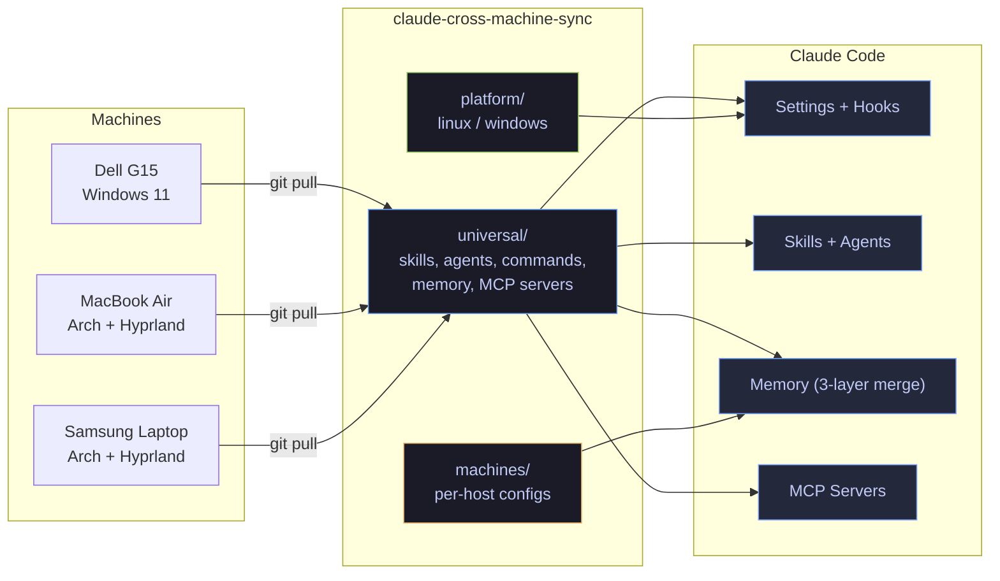

<div align="center">


<br>
<br>

[](https://github.com/robertogogoni/claude-cross-machine-sync/actions/workflows/ci.yml)
[](LICENSE)
[]()
[]()
[]()
[]()

**[Ecosystem](#-the-ecosystem)** · **[Features](#-features)** · **[What's Inside](#-whats-inside)** · **[Quick Start](#-quick-start)** · **[Docs](#-documentation)**

</div>

---

## The Problem

You use Claude Code on multiple machines. You've configured permissions, installed skills, set up hooks, tuned MCP servers, built memory files, and customized Desktop configs *just right*. Then you switch to your laptop and... **start from scratch**.

**Claude Sync solves this.** One repo, one bootstrap command, full sync across every machine.

---

## The Ecosystem



---

## Features

### Core Sync

| Feature | Description |
|:--------|:------------|
| One-command bootstrap | `./bootstrap.sh` deploys settings, skills, agents, commands, scripts, memory, MCP servers, systemd timers, and Desktop config |
| Three-tier classification | Every config auto-categorized as `universal`, `platform/<os>`, or `machines/<hostname>` |
| Real-time watching | Changes sync via `inotifywait` (Linux) / `FileSystemWatcher` (Windows) |
| Smart commits | Auto-tagged `[universal]`, `[linux]`, `[windows]`, `[machine:hostname]` |
| Background daemon | systemd (Linux) or Task Scheduler (Windows) |

### Memory System

| Feature | Description |
|:--------|:------------|
| 3-layer merge | Universal memories + platform memories + machine memories, later layers override |
| Memory-sync MCP | Custom MCP server bridges CLI memories to Claude Desktop via `get_user_profile` tool |
| Auto-index | MEMORY.md regenerated from frontmatter on every deploy |
| Cortex integration | Vector-searchable memory via FTS5 + HNSW embeddings |

### Safety

| Feature | Description |
|:--------|:------------|
| Snapshot & rollback | Every bootstrap creates a restore point. `--rollback` to undo |
| Dry-run mode | `--dry-run` previews all changes without executing |
| Pre-flight validation | Checks git, network, disk, permissions before running |
| Secret protection | API keys templatized with `${BRAVE_API_KEY}` placeholders, never committed |
| Health check | `claude-health` script validates 14 system indicators with color output |
| Backup script | `claude-backup` with rsync, 7-day rotation, and restore procedures |

### Cross-Platform

| Platform | Stack |
|:---------|:------|
| Linux | Bash + inotifywait + systemd |
| Windows | PowerShell + FileSystemWatcher + Task Scheduler |
| macOS | Bash + fswatch *(experimental)* |

---

## What's Inside

### Configuration (deployed by bootstrap.sh)

| Component | Universal | Platform | Machine | Total |
|:----------|:---------:|:--------:|:-------:|:-----:|
| Skills | 3 | - | - | 3 |
| Agents | 4 | - | - | 4 |
| Commands | 6 | - | - | 6 |
| Scripts | 6 | 1 | - | 7 |
| Memory files | 8 | 3 | 4 | 15 |
| MCP servers | 1 | - | - | 1 |
| Systemd units | - | 2 | - | 2 |
| Settings | 1 | - | 2 | 3 |
| Desktop config template | 1 | - | - | 1 |
| Chrome/Hypr configs | - | - | 2 | 2 |

### Knowledge Base (20 learnings)

| Topic | Documents |
|:------|:----------|
| System & Infrastructure | electron-wayland, system-diagnostics-patterns, claude-desktop-linux |
| Chrome & Browser | chrome-performance-tuning, chrome-extension-troubleshooting, native-messaging-chrome-canary |
| Claude Code & AI | custom-instructions-optimization, cli-intelligence-patterns, skill-enforcement-hooks, ai-data-extraction |
| Sync & Memory | cross-machine-sync, machine-sync-patterns, memory-sync-bridge, claude-code-permissions |
| Applications | beeper, beeper-package-conflict-fix, vercel-github-widgets, github-profile-widgets-troubleshooting |
| Other | bash-patterns, personal-communication |

### Visual Documentation (11 diagram sets, 30+ Mermaid charts)

All in [`docs/diagrams/`](docs/diagrams/):

| Diagram | Shows |
|:--------|:------|
| [ecosystem-map](docs/diagrams/ecosystem-map.md) | Machine network + data flow |
| [memory-architecture](docs/diagrams/memory-architecture.md) | Three-layer memory system + classification |
| [mcp-topology](docs/diagrams/mcp-topology.md) | MCP server distribution + communication |
| [chrome-extension-bridge](docs/diagrams/chrome-extension-bridge.md) | Native messaging chain + failure modes |
| [hooks-lifecycle](docs/diagrams/hooks-lifecycle.md) | Session state machine + file protection |
| [full-repo-map](docs/diagrams/full-repo-map.md) | All 2,300+ files by category |
| [knowledge-graph](docs/diagrams/knowledge-graph.md) | 20 learnings with cross-connections |
| [ai-history-map](docs/diagrams/ai-history-map.md) | Warp AI + Antigravity + episodic memory |
| [multi-machine-state](docs/diagrams/multi-machine-state.md) | 3 machines: config overlap |
| [hookify-rules-flow](docs/diagrams/hookify-rules-flow.md) | Skill enforcement + omarchy sync |
| [repo-structure](docs/diagrams/repo-structure.md) | Directory tree + classification decision tree |

### AI History Archive

| Source | Records | Format |
|:-------|:--------|:-------|
| Claude Code episodic memory | 1,402 sessions | JSONL + summaries |
| Warp Terminal AI | 1,708 queries + 49 agents | CSV + JSON |
| Antigravity/Gemini Brain | 14 sessions | Markdown |

### Registered Machines

| Machine | Platform | Status | Configs |
|:--------|:---------|:------:|:-------:|
| Samsung 270E5J | Arch Linux + Hyprland | Active | 10 files |
| MacBook Air | Arch Linux + Hyprland | Active | 11 files |
| Dell G15 | Windows 11 | Pending | 1 file |

---

## Quick Start

### Linux / macOS

```bash
git clone https://github.com/robertogogoni/claude-cross-machine-sync.git ~/machine-sync
cd ~/machine-sync && ./bootstrap.sh
```

### Windows PowerShell

```powershell
git clone https://github.com/robertogogoni/claude-cross-machine-sync.git $HOME\machine-sync
cd $HOME\machine-sync; .\bootstrap.ps1
```

### What Bootstrap Deploys

```
Step 0   Pre-flight validation (git, network, disk, permissions)
Step 1   Hardware auto-detection (vendor, model, CPU, GPU, RAM)
Step 2   Machine registered in machines/registry.yaml
Step 3   Machine directory created with machine.yaml
Step 4   Sync daemon installed (systemd / Task Scheduler)
Step 5   Settings deployed (universal + machine-specific)
Step 5a  Skills (debugging, code-review, testing + omarchy symlink)
Step 5b  Agents (code-reviewer, debugger, test-writer, planner)
Step 5c  Commands (analyze, explain, refactor, security-scan, think-harder, eureka)
Step 5d  Scripts (bash logger, audit tools, memory-sync) + chmod +x
Step 5e  Machine detection scripts
Step 5f  Memory files (3-layer merge: universal -> platform -> machine)
Step 5g  MCP servers (memory-sync + registration via claude mcp add)
Step 5h  Platform scripts + systemd timers (Linux only)
Step 5i  Claude Desktop config (template substitution, JSON validation)
Step 6   Git commit + push
```

### CLI Options

| Flag | Description |
|:-----|:------------|
| `--dry-run` | Preview all changes without executing |
| `--skip-daemon` | Skip sync daemon installation |
| `--skip-preflight` | Skip validation checks |
| `--rollback` | Undo last bootstrap |
| `--machine-name NAME` | Override auto-detected machine name |

### Post-Bootstrap

```bash
claude-health          # Check 14 health indicators
claude-backup          # Backup everything not in git
claude-memory-sync     # Manually sync CLI memories to Desktop
```

---

## Documentation

| Document | Purpose |
|:---------|:--------|
| **[INDEX.md](docs/INDEX.md)** | "I need to..." quick-start navigation |
| **[INSIGHTS.md](docs/INSIGHTS.md)** | WHY behind every major decision (12 insights) |
| **[RUNBOOK.md](docs/RUNBOOK.md)** | 15 troubleshooting scenarios with copy-paste fixes |
| **[Architecture Decisions](docs/decisions/architecture-decisions.md)** | 8 ADRs with context, decision, consequences |
| **[Tools Inventory](docs/system/tools-inventory.md)** | Full software/package inventory per machine |
| **[Backup Strategy](docs/system/BACKUP-STRATEGY.md)** | What's NOT in git, how to back it up, restore procedures |
| **[CHANGELOG.md](CHANGELOG.md)** | 83 commits grouped by date, Keep a Changelog format |
| **[CONTRIBUTING.md](CONTRIBUTING.md)** | How to contribute |
| **[ROADMAP.md](ROADMAP.md)** | Full roadmap with phases and progress |

---

## Directory Structure

```
claude-cross-machine-sync/
├── bootstrap.sh / .ps1         # One-command setup (Linux/Windows)
├── CHANGELOG.md                # Version history
│
├── universal/                  # Cross-platform (works everywhere)
│   ├── claude/
│   │   ├── skills/             # 3 skills (debugging, code-review, testing)
│   │   ├── agents/             # 4 agents (code-reviewer, debugger, test-writer, planner)
│   │   ├── commands/           # 6 slash commands
│   │   ├── scripts/            # Bash logger, audit tools, health check, memory-sync
│   │   ├── machines/           # Hardware detection scripts
│   │   ├── memory/             # 8 universal memory files
│   │   └── mcp-servers/        # memory-sync MCP server
│   └── electron/               # Wayland flags for all Electron apps
│
├── platform/                   # OS-specific
│   ├── linux/                  # systemd units, auto-updater, 3 platform memories
│   └── windows/                # PowerShell scripts, Task Scheduler
│
├── machines/                   # Hardware-specific
│   ├── registry.yaml           # Machine ecosystem definition
│   ├── samsung-laptop/         # Settings, chrome flags, hypr, 4 memories
│   ├── macbook-air/            # Browser flags, fcitx5, hypr
│   └── dell-g15/               # Minimal (pending bootstrap)
│
├── learnings/                  # 20 reusable knowledge documents
├── docs/
│   ├── diagrams/               # 11 Mermaid diagram sets (30+ charts)
│   ├── decisions/              # 8 Architecture Decision Records
│   ├── sessions/               # Detailed session logs
│   ├── plans/                  # Design documents
│   ├── guides/                 # How-to guides
│   └── system/                 # Inventory, backup strategy
│
├── episodic-memory/            # 1,402 conversation archives
├── warp-ai/                    # 1,708 AI queries from Warp Terminal
├── antigravity-history/        # 14 Gemini Brain sessions
├── hookify-rules/              # 5 skill enforcement rules
├── scripts/                    # claude-health, claude-backup
├── lib/                        # validator.sh, rollback.sh
└── tests/                      # 24 unit tests
```

---

## Configuration

### Machine Registry

```yaml
# machines/registry.yaml
machines:
  samsung-laptop:
    hostname: omarchy
    platform: linux
    status: active
    hardware:
      vendor: Samsung
      model: 270E5J
      cpu: Intel Core i7-4510U
      gpu: Intel HD 4400
```

### Three-Tier Classification

| Tier | Path | Rule | Example |
|:-----|:-----|:-----|:--------|
| Universal | `universal/` | Works on any machine, no hardcoded paths | Skills, agents, commands |
| Platform | `platform/<os>/` | Uses OS-specific tools (systemd, pacman) | Auto-updater, systemd units |
| Machine | `machines/<name>/` | Contains hardware values or hardcoded paths | Chrome scale factor, display DPI |

### Commit Tags

| Tag | Use Case |
|:----|:---------|
| `[universal]` | Cross-platform changes |
| `[linux]` | Linux-specific |
| `[windows]` | Windows-specific |
| `[machine:hostname]` | Machine-specific configs |

---

## Contributing

Contributions welcome! See [CONTRIBUTING.md](CONTRIBUTING.md) for guidelines.

```bash
git clone https://github.com/robertogogoni/claude-cross-machine-sync.git
cd claude-cross-machine-sync
./tests/run_all.sh       # Run tests
shellcheck -x lib/*.sh   # Lint
```

---

## License

[MIT License](LICENSE)

---

<div align="center">

**[Docs](docs/)** · **[Diagrams](docs/diagrams/)** · **[Report Bug](https://github.com/robertogogoni/claude-cross-machine-sync/issues)** · **[Request Feature](https://github.com/robertogogoni/claude-cross-machine-sync/issues)**

<br>

Built with [Claude Code](https://claude.ai/code) by Anthropic

</div>
