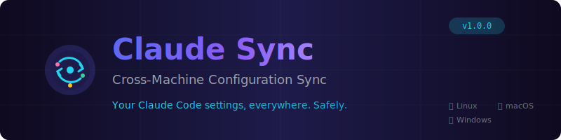

<div align="center">



<br>
<br>

[](https://github.com/robertogogoni/claude-cross-machine-sync/actions/workflows/ci.yml)
[](LICENSE)
[]()
[]()
[]()
[]()

**[Features](#-features)** · **[Installation](#-installation)** · **[Roadmap](#-roadmap)** · **[Contributing](#-contributing)**

</div>

---

## 🤔 The Problem

You use Claude Code on multiple machines. You've configured permissions, installed skills, set up hooks, and tuned settings *just right*. Then you switch to your laptop and... **start from scratch**.

| Pain Point | Description |
|:-----------|:------------|
| ❌ No sync | Settings don't sync between machines |
| ❌ Manual drift | Copying leads to configs getting out of sync |
| ❌ Merge fear | Git conflicts in configs are scary to resolve |
| ❌ No undo | No rollback when things break |
| ❌ Offline chaos | Offline work creates sync nightmares |

**Claude Sync solves this.** Production-grade config synchronization with safety built in.

---

## ✨ Features

### 🚀 Core Sync

| Feature | Description |
|:--------|:------------|
| One-command bootstrap | `./bootstrap.sh` and you're done |
| Real-time watching | Changes sync automatically via `inotifywait` / `FileSystemWatcher` |
| Smart categorization | Auto-tags commits as `[universal]`, `[linux]`, `[windows]`, `[machine:hostname]` |
| Background daemon | systemd (Linux) or Task Scheduler (Windows) |

### 🛡️ Safety First

| Feature | Description |
|:--------|:------------|
| Pre-flight validation | Checks git, network, disk, permissions **before** running |
| Snapshot & rollback | Every bootstrap creates a restore point |
| Dry-run mode | `--dry-run` previews changes without executing |
| Path sanitization | Protects against path traversal attacks |

### 🌐 Network Resilience

| Feature | Description |
|:--------|:------------|
| Offline queue | Commits save locally when offline, push when connected |
| Exponential backoff | Failed pushes retry at `5s → 15s → 60s` |
| Conflict resolution | Auto-resolve → Stash & retry → Conflict branch |

### 💻 Cross-Platform Support

| Platform | Stack |
|:---------|:------|
| Linux | Bash + inotifywait + systemd |
| Windows | PowerShell + FileSystemWatcher + Task Scheduler |
| macOS | Bash + fswatch *(experimental)* |

---

## 📦 Installation

### Quick Start

**Linux / macOS:**

```bash
git clone https://github.com/robertogogoni/claude-cross-machine-sync.git ~/machine-sync
cd ~/machine-sync && ./bootstrap.sh
```

**Windows PowerShell:**

```powershell
git clone https://github.com/robertogogoni/claude-cross-machine-sync.git $HOME\machine-sync
cd $HOME\machine-sync; .\bootstrap.ps1
```

### What Happens

```
Step 1  ✅  Hardware auto-detected (vendor, model, CPU, GPU, RAM)
Step 2  ✅  Machine registered in machines/registry.yaml
Step 3  ✅  Sync daemon installed (systemd or Task Scheduler)
Step 4  ✅  Configs deployed to ~/.claude/
Step 5  ✅  First sync pushed to git
```

### CLI Options

| Flag | Description |
|:-----|:------------|
| `--dry-run` | Preview changes without executing |
| `--skip-preflight` | Skip validation checks |
| `--rollback` | Undo last bootstrap |
| `--status` | Show daemon status |

---

## 🏗️ Architecture

```
                         +------------------+
                         |  CLI Interface   |
                         +------------------+
                                  |
         +------------+----------+----------+------------+
         |            |                     |            |
         v            v                     v            v
   +-----------+ +-----------+       +-----------+ +-----------+
   | bootstrap | |   sync    |       | validator | | rollback  |
   |    .sh    | | daemon.sh |       |    .sh    | |    .sh    |
   +-----------+ +-----------+       +-----------+ +-----------+
         |            |                     |            |
         +------------+----------+----------+------------+
                                 |
                    +------------+------------+
                    |     Core Library        |
                    |        (lib/)           |
                    +-------------------------+
                    | validator | rollback    |
                    | git ops   | file watch  |
                    | offline q | categorizer |
                    +-------------------------+
                                 |
                    +------------+------------+
                    |   Platform Adapters     |
                    +-------------------------+
                    | Linux    | Windows      |
                    | (systemd)| (Task Sched) |
                    | macOS    | (launchd)    |
                    +-------------------------+
```

### Directory Structure

```
machine-sync/
├── bootstrap.sh            # Linux/macOS setup
├── bootstrap.ps1           # Windows setup
├── lib/
│   ├── validator.sh        # Pre-flight checks (454 lines)
│   └── rollback.sh         # Snapshot/restore (370 lines)
├── machines/
│   ├── registry.yaml       # Machine definitions
│   └── <hostname>/         # Machine-specific configs
├── platform/
│   ├── linux/scripts/      # Linux daemon (667 lines)
│   └── windows/scripts/    # Windows daemon
├── universal/              # Cross-platform shared configs
└── tests/                  # 24 unit tests
```

---

## 🗺️ Roadmap

### Progress

```
Overall    ▰▰▰▰▰▰▰▰▰▰▰▰▱▱▱▱▱▱▱▱  60%
```

| Phase | Name | Status | Progress |
|:-----:|:-----|:------:|:--------:|
| 1 | Foundation | ✅ | 100% |
| 2 | Reliability | 🔄 | 80% |
| 3 | Security | 🔄 | 40% |
| 4 | Cross-Platform | ⏳ | 0% |
| 5 | Testing & CI | 🔄 | 80% |
| 6 | Documentation | 🔄 | 60% |

### v1.0.0 — Current Sprint

| Category | Item | Status |
|:---------|:-----|:------:|
| Foundation | Pre-flight validation | ✅ |
| Foundation | Dry-run mode | ✅ |
| Foundation | Snapshot & rollback | ✅ |
| Reliability | Retry with backoff | ✅ |
| Reliability | Offline queue | ✅ |
| Reliability | Conflict resolution | ✅ |
| Testing | Unit tests (24) | ✅ |
| Testing | CI/CD pipeline | ✅ |
| Docs | README rewrite | ✅ |
| Docs | CONTRIBUTING.md | ✅ |

### v1.1.0 — Next

| Item | Description |
|:-----|:------------|
| macOS support | Full fswatch + launchd integration |
| Secrets encryption | age/GPG at-rest encryption |
| Selective sync | `.syncignore` pattern file |
| Web dashboard | Status monitoring UI |

See [ROADMAP.md](ROADMAP.md) for the complete roadmap.

---

## 🔧 Configuration

### Machine Registry

```yaml
# machines/registry.yaml
machines:
  my-laptop:
    hostname: my-laptop
    platform: linux
    status: active
    hardware:
      vendor: Dell
      model: XPS 15
      cpu: Intel i7-12700H
      memory: 32GB
```

### Environment Variables

| Variable | Default | Description |
|:---------|:--------|:------------|
| `SNAPSHOT_DIR` | `~/.local/state/machine-sync/snapshots` | Snapshot storage |
| `SNAPSHOT_RETENTION_DAYS` | `30` | Auto-cleanup threshold |
| `RETRY_COUNT` | `3` | Push retry attempts |
| `OFFLINE_QUEUE_DIR` | `~/.local/state/machine-sync/offline-queue` | Offline commits |

---

## 🤝 Contributing

Contributions welcome! See [CONTRIBUTING.md](CONTRIBUTING.md) for guidelines.

```bash
# Development setup
git clone https://github.com/robertogogoni/claude-cross-machine-sync.git
cd claude-cross-machine-sync

# Run tests
./tests/run_all.sh

# Lint
shellcheck -x lib/*.sh bootstrap.sh
```

### Commit Tags

| Tag | Use Case |
|:----|:---------|
| `[universal]` | Changes for all platforms |
| `[linux]` | Linux-specific |
| `[windows]` | Windows-specific |
| `[machine:hostname]` | Machine-specific configs |
| `[docs]` | Documentation only |
| `[tests]` | Test changes |

---

## 📄 License

[MIT License](LICENSE) — see LICENSE file for details.

---

## 🙏 Credits

Built with [Claude Code](https://claude.ai/code) by Anthropic.

**Inspired by:** [chezmoi](https://www.chezmoi.io/) · [yadm](https://yadm.io/) · [stow](https://www.gnu.org/software/stow/)

---

<div align="center">

**[Docs](docs/)** · **[Report Bug](https://github.com/robertogogoni/claude-cross-machine-sync/issues)** · **[Request Feature](https://github.com/robertogogoni/claude-cross-machine-sync/issues)**

<br>

Made with ☕ and Claude Code

⭐ **Star this repo if it helps you!**

</div>
