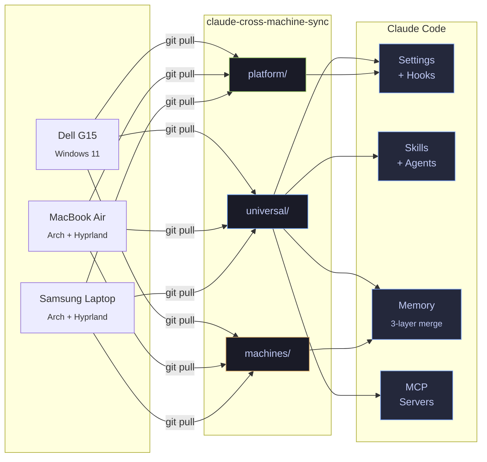

<div align="center">


<p>
  <a href="https://github.com/robertogogoni/claude-cross-machine-sync/releases/latest"></a>
  <a href="https://github.com/robertogogoni/claude-cross-machine-sync/actions/workflows/ci.yml"></a>
  <a href="LICENSE"></a>
  <a href="https://github.com/robertogogoni/claude-cross-machine-sync/releases"></a>
</p>

One repo. One bootstrap command. Every machine gets the same Claude Code brain.

Settings, skills, agents, commands, memory, MCP servers, hooks, and Desktop configs sync automatically across Linux, Windows, and macOS.

</div>

---

### The Ecosystem



---

### Quick Start

```bash
# Linux / macOS
git clone https://github.com/robertogogoni/claude-cross-machine-sync.git ~/machine-sync
cd ~/machine-sync && ./bootstrap.sh
```

```powershell
# Windows
git clone https://github.com/robertogogoni/claude-cross-machine-sync.git $HOME\machine-sync
cd $HOME\machine-sync; .\bootstrap.ps1
```

That's it. Hardware is auto-detected, configs are deployed, sync daemon starts in the background.

<details>
<summary><b>What gets deployed</b></summary>

<br>

```
 0   Pre-flight validation
 1   Hardware auto-detection (vendor, model, CPU, GPU, RAM)
 2   Machine registered in registry.yaml
 3   Machine directory created
 4   Sync daemon installed
 5   Settings deployed (universal + machine-specific)
 5a  Skills .............. debugging, code-review, testing
 5b  Agents .............. code-reviewer, debugger, test-writer, planner
 5c  Commands ............ analyze, explain, refactor, security-scan, think-harder, eureka
 5d  Scripts ............. bash logger, audit tools, memory-sync, health check
 5e  Machine detection ... auto-detect hardware profile
 5f  Memory .............. 3-layer merge (universal > platform > machine)
 5g  MCP servers ......... memory-sync + registration
 5h  Platform scripts .... auto-updater + systemd timers (Linux)
 5i  Desktop config ...... template substitution + JSON validation
 6   Git commit + push
```

</details>

---

### How It Works

Every config file is classified into one of three tiers:

| Tier | What goes here | Example |
|:-----|:---------------|:--------|
| `universal/` | Works on any machine | Skills, agents, commands, memory |
| `platform/` | OS-specific | systemd units, PowerShell scripts |
| `machines/` | Hardware-specific | Display scale, GPU flags, CPU threads |

Changes sync automatically via background daemons (`inotifywait` on Linux, `FileSystemWatcher` on Windows). Commits are auto-tagged `[universal]`, `[linux]`, `[windows]`, or `[machine:hostname]`.

<details>
<summary><b>Memory system</b></summary>

<br>

Three-layer architecture:

1. **CLI Memory files** (source of truth) at `~/.claude/projects/<project>/memory/`
2. **Cortex DB** (vector-searchable) with FTS5 + HNSW embeddings
3. **Memory Profile** (compiled bridge) served to Claude Desktop via MCP

When CLI session ends, memories auto-compile into a 337-line profile. Claude Desktop reads it via the `get_user_profile` MCP tool. The sync is one-directional: CLI writes, Desktop reads.

See [memory architecture diagram](docs/diagrams/memory-architecture.md) for the full picture.

</details>

<details>
<summary><b>Safety features</b></summary>

<br>

| Feature | How it works |
|:--------|:-------------|
| Snapshot & rollback | Every bootstrap creates a restore point. `--rollback` to undo. |
| Dry-run mode | `--dry-run` previews all steps without executing |
| Pre-flight checks | Validates git, network, disk, permissions before running |
| Secret protection | API keys use `${VARIABLE}` placeholders, never committed |
| Health check | `claude-health` validates 14 system indicators |
| Backup | `claude-backup` with rsync and 7-day rotation |
| Offline queue | Commits save locally when offline, push when connected |
| Conflict resolution | Auto-resolve, stash & retry, or conflict branch |

</details>

---

### Machines

| Machine | Platform | Status | Configs |
|:--------|:---------|:------:|--------:|
| Samsung 270E5J | Arch Linux + Hyprland | Active | 10 |
| MacBook Air | Arch Linux + Hyprland | Active | 11 |
| Dell G15 | Windows 11 | Pending | 1 |

---

### Post-Bootstrap Tools

```bash
claude-health          # 14 health checks with color output
claude-backup          # Backup everything not in git (rsync, 7-day rotation)
claude-memory-sync     # Manually sync CLI memories to Desktop
claude-desktop-update  # Auto-update Claude Desktop from AUR (runs daily via systemd)
```

---

### Documentation

<table>
<tr>
<td width="50%" valign="top">

**Navigate**
- [INDEX.md](docs/INDEX.md) -- "I need to..." quick start
- [RUNBOOK.md](docs/RUNBOOK.md) -- 15 troubleshooting scenarios
- [CHANGELOG.md](CHANGELOG.md) -- 11 releases, 97 commits

</td>
<td width="50%" valign="top">

**Understand**
- [INSIGHTS.md](docs/INSIGHTS.md) -- WHY behind 12 key decisions
- [ADRs](docs/decisions/architecture-decisions.md) -- 8 architecture records
- [Tools Inventory](docs/system/tools-inventory.md) -- Full software list

</td>
</tr>
<tr>
<td width="50%" valign="top">

**Operate**
- [Backup Strategy](docs/system/BACKUP-STRATEGY.md) -- What to backup, how to restore
- [Bootstrap Plan](docs/plans/bootstrap-new-deploy-steps.md) -- Deploy steps design
- [Session Logs](docs/sessions/) -- Detailed session records

</td>
<td width="50%" valign="top">

**Visualize**
- [Ecosystem Map](docs/diagrams/ecosystem-map.md)
- [Memory Architecture](docs/diagrams/memory-architecture.md)
- [MCP Topology](docs/diagrams/mcp-topology.md)
- [Full Repo Map](docs/diagrams/full-repo-map.md)
- [+ 7 more diagram sets](docs/diagrams/)

</td>
</tr>
</table>

<details>
<summary><b>Learnings (20 knowledge documents)</b></summary>

<br>

| Category | Documents |
|:---------|:----------|
| System | [electron-wayland](learnings/electron-wayland.md) -- [system-diagnostics](learnings/system-diagnostics-patterns.md) -- [claude-desktop-linux](learnings/claude-desktop-linux.md) |
| Chrome | [performance-tuning](learnings/chrome-performance-tuning.md) -- [extension-troubleshooting](learnings/chrome-extension-troubleshooting.md) -- [native-messaging](learnings/native-messaging-chrome-canary.md) |
| Claude & AI | [custom-instructions](learnings/custom-instructions-optimization.md) -- [cli-intelligence](learnings/cli-intelligence-patterns.md) -- [skill-hooks](learnings/skill-enforcement-hooks.md) -- [ai-extraction](learnings/ai-data-extraction.md) |
| Sync & Memory | [cross-machine-sync](learnings/cross-machine-sync.md) -- [machine-patterns](learnings/machine-sync-patterns.md) -- [memory-bridge](learnings/memory-sync-bridge.md) -- [permissions](learnings/claude-code-permissions.md) |
| Apps | [beeper](learnings/beeper.md) -- [beeper-fix](learnings/beeper-package-conflict-fix.md) -- [vercel-widgets](learnings/vercel-github-widgets.md) -- [github-widgets](learnings/github-profile-widgets-troubleshooting.md) |
| Other | [bash-patterns](learnings/bash-patterns.md) -- [personal-communication](learnings/personal-communication.md) |

</details>

<details>
<summary><b>AI History Archive</b></summary>

<br>

| Source | Records |
|:-------|--------:|
| Claude Code episodic memory | 1,402 sessions |
| Warp Terminal AI queries | 1,708 queries |
| Warp Terminal agents | 49 conversations |
| Antigravity / Gemini Brain | 14 sessions |

</details>

---

### Directory Structure

```
claude-cross-machine-sync/
.
├── bootstrap.sh / .ps1              # One-command setup
├── CHANGELOG.md                     # 11 releases
│
├── universal/claude/                # Cross-platform configs
│   ├── skills/                      #   3 skills
│   ├── agents/                      #   4 agents
│   ├── commands/                    #   6 slash commands
│   ├── scripts/                     #   health check, audit, sync
│   ├── memory/                      #   8 universal memories
│   └── mcp-servers/                 #   memory-sync bridge
│
├── platform/                        # OS-specific
│   ├── linux/                       #   systemd, auto-updater
│   └── windows/                     #   PowerShell, Task Scheduler
│
├── machines/                        # Per-host configs
│   ├── registry.yaml
│   ├── samsung-laptop/              #   10 files
│   ├── macbook-air/                 #   11 files
│   └── dell-g15/                    #   1 file (pending)
│
├── learnings/                       # 20 knowledge docs
├── docs/
│   ├── diagrams/                    #   11 Mermaid sets (30+ charts)
│   ├── decisions/                   #   8 ADRs
│   ├── plans/                       #   12 design docs
│   └── system/                      #   inventory, backup
│
├── episodic-memory/                 # 1,402 session archives
├── warp-ai/                         # 1,708 AI queries
├── hookify-rules/                   # 5 skill enforcement rules
├── scripts/                         # health, backup
├── lib/                             # validator, rollback
└── tests/                           # 24 unit tests
```

---

### CLI Reference

| Flag | Description |
|:-----|:------------|
| `--dry-run` | Preview changes without executing |
| `--rollback` | Undo last bootstrap |
| `--skip-daemon` | Skip sync daemon install |
| `--skip-preflight` | Skip validation checks |
| `--machine-name NAME` | Override auto-detected name |

---

### Contributing

See [CONTRIBUTING.md](CONTRIBUTING.md). Run tests with `./tests/run_all.sh`. Lint with `shellcheck -x lib/*.sh bootstrap.sh`.

---

<div align="center">

<sub>Built with <a href="https://claude.ai/code">Claude Code</a></sub>

<sub>[MIT License](LICENSE)</sub>

</div>
