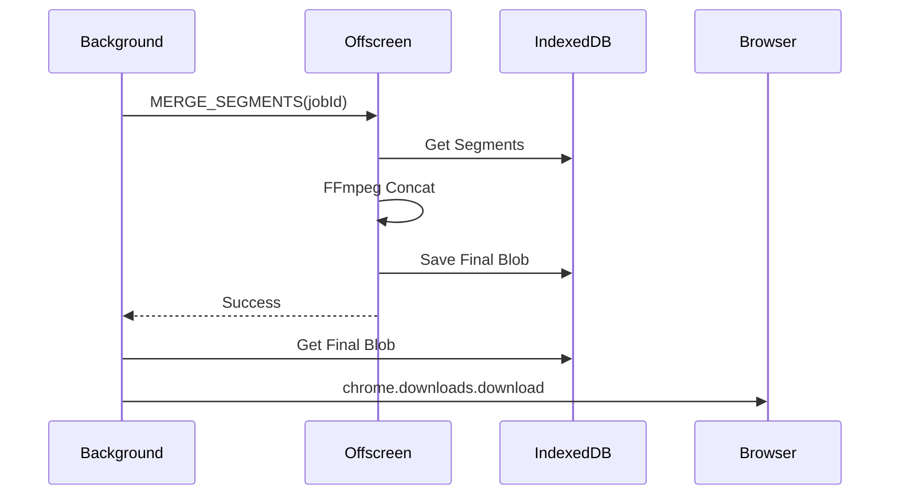

# Phase 6: UI Polishing & Merging Logic Implementation Plan

## Goal
Finalize the download workflow by merging downloaded segments into a single file using FFmpeg and providing a polished UI for tracking progress.

## Components

### 1. Offscreen Merging (`src/offscreen/main.ts`)
- **Action**: Implement `MERGE_SEGMENTS` handler.
- **Logic**:
  1. Receive `jobId`.
  2. Query `segmentsDb` for all completed segments, sorted by index.
  3. Write segment data to FFmpeg's virtual filesystem (MEMFS).
  4. Generate a `concat_list.txt` or input arguments.
  5. specific command: `ffmpeg -f concat -i list.txt -c copy output.mp4`.
  6. Read `output.mp4`.
  7. Return result (Blob) to background? Or trigger download from Offscreen? 
     - *Note*: Background can't easily handle huge Blobs from messages. 
     - *Better*: Offscreen triggers the download or stores the final blob back to `downloadsDb` (if size permits).
     - *Decision*: Offscreen returns a Blob reference or Object URL? Object URLs revoke on context close.
     - *Refined Plan*: Offscreen stores final Blob in `downloadsDb` (as `blob` field in job?) or triggers `chrome.downloads` directly? 
     - `chrome.downloads` is available in Offscreen? No, usually only in Background/Popup.
     - *Hypothesis*: Store in `downloadsDb` as a `Blob`. Background reads it and triggers save. Use `indexedDB` interaction from Offscreen.

### 2. `FFmpegManager`
- **Method**: `mergeSegments(jobId: string)`
- **Returns**: Promise<void> (Signals completion).

### 3. `DownloadManager`
- **State Transition**: `downloading` -> `merging` -> `completed`.
- **Action**: On `completed`, trigger `chrome.downloads.download` with the final blob url (created from DB blob).

### 4. UI Components (`src/popup/components/DownloadList.tsx`)
- Display list of `downloads`.
- Show progress bar, speed, status badge.
- "Play" button (opens in new tab/player).
- "Save" button (if not auto-saved).

## Architecture

## Steps
1. Update `src/offscreen/main.ts` with DB access and FFmpeg logic.
2. Update `FFmpegManager.ts`.
3. Update `DownloadManager.ts`.
4. Create/Update UI components.
