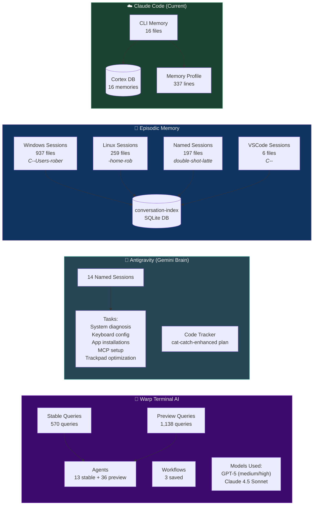
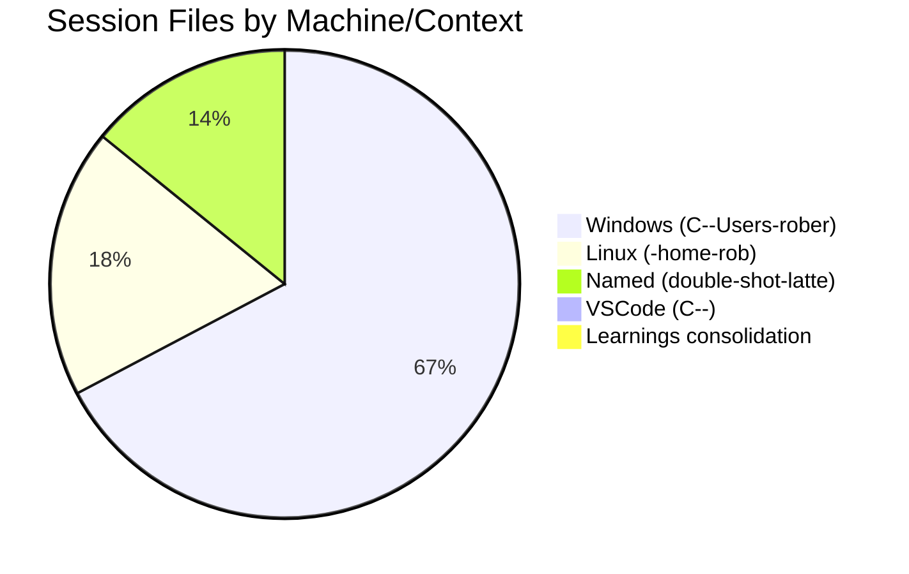
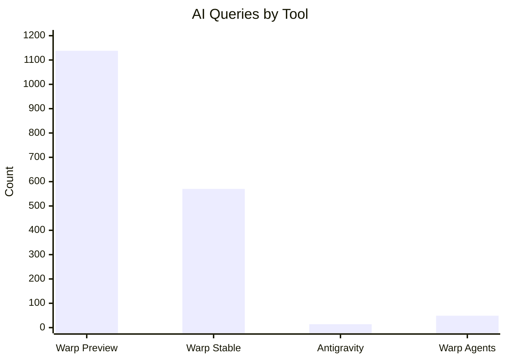

# AI Tool Usage History

## Cross-Platform AI History

```mermaid
graph LR
    subgraph warp["🔮 Warp Terminal AI"]
        warp_stable["Stable Queries<br/>570 queries"]
        warp_preview["Preview Queries<br/>1,138 queries"]
        warp_agents["Agents<br/>13 stable + 36 preview"]
        warp_workflows["Workflows<br/>3 saved"]
        warp_models["Models Used:<br/>GPT-5 (medium/high)<br/>Claude 4.5 Sonnet"]
    end

    subgraph antigravity["🌌 Antigravity (Gemini Brain)"]
        ag_sessions["14 Named Sessions"]
        ag_tasks["Tasks:<br/>System diagnosis<br/>Keyboard config<br/>App installations<br/>MCP setup<br/>Trackpad optimization"]
        ag_code["Code Tracker<br/>cat-catch-enhanced plan"]
    end

    subgraph episodic["🧠 Episodic Memory"]
        ep_windows["Windows Sessions<br/>937 files<br/><i>C--Users-rober</i>"]
        ep_linux["Linux Sessions<br/>259 files<br/><i>-home-rob</i>"]
        ep_named["Named Sessions<br/>197 files<br/><i>double-shot-latte</i>"]
        ep_vscode["VSCode Sessions<br/>6 files<br/><i>C--</i>"]
        ep_index[("conversation-index<br/>SQLite DB")]
    end

    subgraph claude_current["☁️ Claude Code (Current)"]
        cortex_db[("Cortex DB<br/>16 memories")]
        cli_memory["CLI Memory<br/>16 files"]
        memory_profile["Memory Profile<br/>337 lines"]
    end

    warp_stable & warp_preview --> warp_agents
    ag_sessions --> ag_tasks
    ep_windows & ep_linux & ep_named & ep_vscode --> ep_index
    cli_memory --> memory_profile
    cli_memory --> cortex_db

    style warp fill:#3c096c,stroke:#7b2cbf,color:#eee
    style antigravity fill:#264653,stroke:#2a9d8f,color:#eee
    style episodic fill:#0f3460,stroke:#533483,color:#eee
    style claude_current fill:#1b4332,stroke:#40916c,color:#eee
```

## Episodic Memory Distribution

```mermaid
pie title Session Files by Machine/Context
    "Windows (C--Users-rober)" : 937
    "Linux (-home-rob)" : 259
    "Named (double-shot-latte)" : 197
    "VSCode (C--)" : 6
    "Learnings consolidation" : 3
```

## AI Query Volume

```mermaid
xychart-beta
    title "AI Queries by Tool"
    x-axis ["Warp Preview", "Warp Stable", "Antigravity", "Warp Agents"]
    y-axis "Count" 0 --> 1200
    bar [1138, 570, 14, 49]
```
