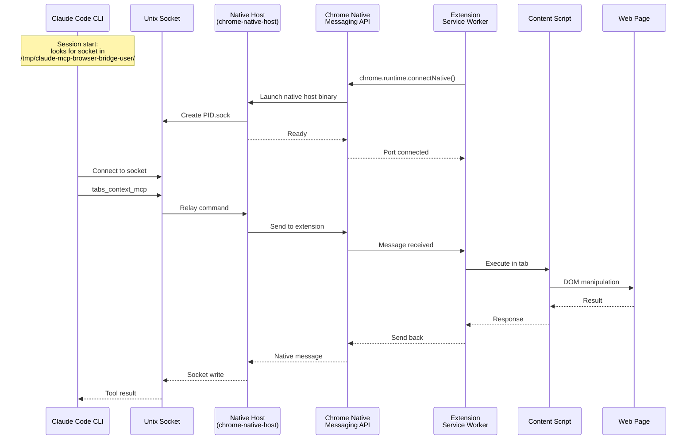
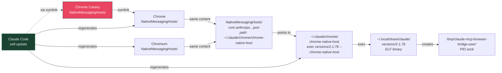
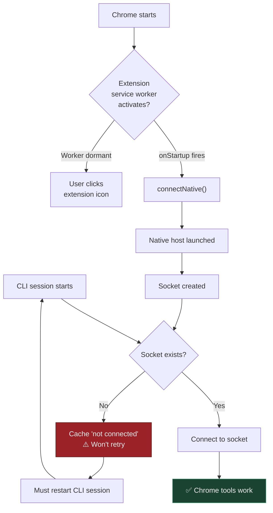

# Chrome Extension Bridge Architecture

## Connection Chain

```mermaid
sequenceDiagram
    participant CL as Claude Code CLI
    participant SK as Unix Socket
    participant NH as Native Host<br/>(chrome-native-host)
    participant NM as Chrome Native<br/>Messaging API
    participant SW as Extension<br/>Service Worker
    participant CS as Content Script
    participant Page as Web Page

    Note over CL: Session start:<br/>looks for socket in<br/>/tmp/claude-mcp-browser-bridge-user/

    SW->>NM: chrome.runtime.connectNative()
    NM->>NH: Launch native host binary
    NH->>SK: Create PID.sock
    NH-->>NM: Ready
    NM-->>SW: Port connected

    CL->>SK: Connect to socket

    CL->>SK: tabs_context_mcp
    SK->>NH: Relay command
    NH->>NM: Send to extension
    NM->>SW: Message received
    SW->>CS: Execute in tab
    CS->>Page: DOM manipulation
    Page-->>CS: Result
    CS-->>SW: Response
    SW-->>NM: Send back
    NM-->>NH: Native message
    NH-->>SK: Socket write
    SK-->>CL: Tool result
```

## File Chain (What Points Where)

```mermaid
graph LR
    manifest["NativeMessagingHosts/<br/>com.anthropic...json<br/><i>path: ~/.claude/chrome/chrome-native-host</i>"]
    script["~/.claude/chrome/<br/>chrome-native-host<br/><i>exec versions/2.1.78 --chrome-native-host</i>"]
    binary["~/.local/share/claude/<br/>versions/2.1.78<br/><i>ELF binary</i>"]
    socket["/tmp/claude-mcp-browser-bridge-user/<br/>PID.sock"]

    manifest -->|"points to"| script
    script -->|"exec"| binary
    binary -->|"creates"| socket

    canary_manifest["Chrome Canary<br/>NativeMessagingHosts/"]
    chrome_manifest["Chrome<br/>NativeMessagingHosts/"]
    chromium_manifest["Chromium<br/>NativeMessagingHosts/"]

    canary_manifest -->|"symlink"| chrome_manifest
    chrome_manifest -->|"same content"| manifest
    chromium_manifest -->|"same content"| manifest

    claude_update["Claude Code<br/>self-update"]
    claude_update -->|"regenerates"| script
    claude_update -->|"regenerates"| chrome_manifest
    claude_update -->|"regenerates"| chromium_manifest
    claude_update -.->|"via symlink"| canary_manifest

    style canary_manifest fill:#e94560,stroke:#1a1a2e,color:#fff
    style claude_update fill:#1b4332,stroke:#40916c,color:#eee
```

## Known Failure Modes

```mermaid
graph TD
    start["CLI session starts"] --> check{"Socket exists?"}
    check -->|"Yes"| connect["Connect to socket"]
    check -->|"No"| fail["Cache 'not connected'<br/>⚠️ Won't retry"]

    connect --> works["✅ Chrome tools work"]
    fail --> restart["Must restart CLI session"]
    restart --> start

    chrome_start["Chrome starts"] --> ext_activate{"Extension<br/>service worker<br/>activates?"}
    ext_activate -->|"onStartup fires"| native["connectNative()"]
    ext_activate -->|"Worker dormant"| click["User clicks<br/>extension icon"]
    click --> native
    native --> host["Native host launched"]
    host --> sock["Socket created"]
    sock --> check

    style fail fill:#9b2226,stroke:#5c2018,color:#eee
    style works fill:#1b4332,stroke:#40916c,color:#eee
```
