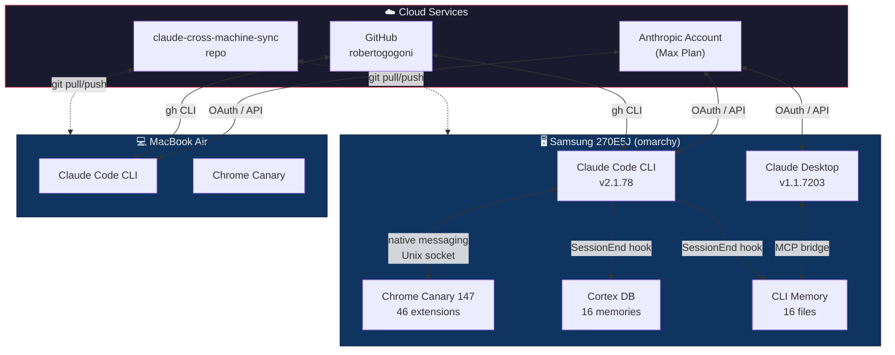
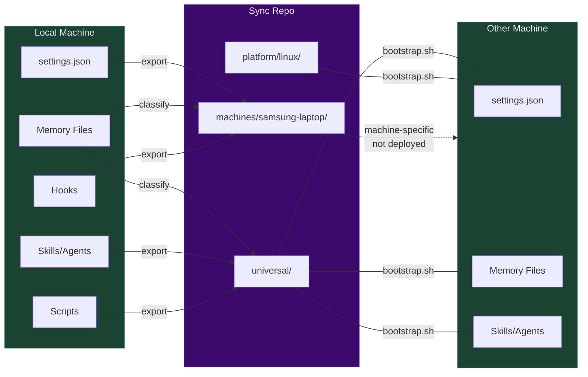

# Ecosystem Map

## Machine Network

```mermaid
graph TB
    subgraph cloud["☁️ Cloud Services"]
        anthropic["Anthropic Account<br/>(Max Plan)"]
        github["GitHub<br/>robertogogoni"]
        syncrepo["claude-cross-machine-sync<br/>repo"]
    end

    subgraph samsung["🖥️ Samsung 270E5J (omarchy)"]
        direction TB
        cli_s["Claude Code CLI<br/>v2.1.78"]
        desktop_s["Claude Desktop<br/>v1.1.7203"]
        chrome_s["Chrome Canary 147<br/>46 extensions"]
        cortex_s["Cortex DB<br/>16 memories"]
        memory_s["CLI Memory<br/>16 files"]
    end

    subgraph macbook["💻 MacBook Air"]
        cli_m["Claude Code CLI"]
        chrome_m["Chrome Canary"]
    end

    anthropic <-->|"OAuth / API"| cli_s
    anthropic <-->|"OAuth / API"| desktop_s
    anthropic <-->|"OAuth / API"| cli_m
    github <-->|"gh CLI"| cli_s
    github <-->|"gh CLI"| cli_m
    syncrepo <-.->|"git pull/push"| samsung
    syncrepo <-.->|"git pull/push"| macbook
    cli_s <-->|"native messaging<br/>Unix socket"| chrome_s
    desktop_s <-->|"MCP bridge"| memory_s
    cli_s -->|"SessionEnd hook"| cortex_s
    cli_s -->|"SessionEnd hook"| memory_s

    style cloud fill:#1a1a2e,stroke:#e94560,color:#eee
    style samsung fill:#0f3460,stroke:#16213e,color:#eee
    style macbook fill:#0f3460,stroke:#16213e,color:#eee
```

## Data Flow Between Machines

```mermaid
flowchart LR
    subgraph local["Local Machine"]
        settings["settings.json"]
        memories["Memory Files"]
        skills["Skills/Agents"]
        scripts["Scripts"]
        hooks["Hooks"]
    end

    subgraph repo["Sync Repo"]
        universal["universal/"]
        platform["platform/linux/"]
        machine["machines/samsung-laptop/"]
    end

    subgraph other["Other Machine"]
        settings2["settings.json"]
        memories2["Memory Files"]
        skills2["Skills/Agents"]
    end

    settings -->|"export"| machine
    memories -->|"classify"| universal
    memories -->|"classify"| machine
    skills -->|"export"| universal
    scripts -->|"export"| universal
    hooks -->|"export"| machine

    universal -->|"bootstrap.sh"| settings2
    universal -->|"bootstrap.sh"| memories2
    universal -->|"bootstrap.sh"| skills2
    platform -->|"bootstrap.sh"| settings2
    machine -.->|"machine-specific<br/>not deployed"| other

    style local fill:#1b4332,stroke:#2d6a4f,color:#eee
    style repo fill:#3c096c,stroke:#5a189a,color:#eee
    style other fill:#1b4332,stroke:#2d6a4f,color:#eee
```
