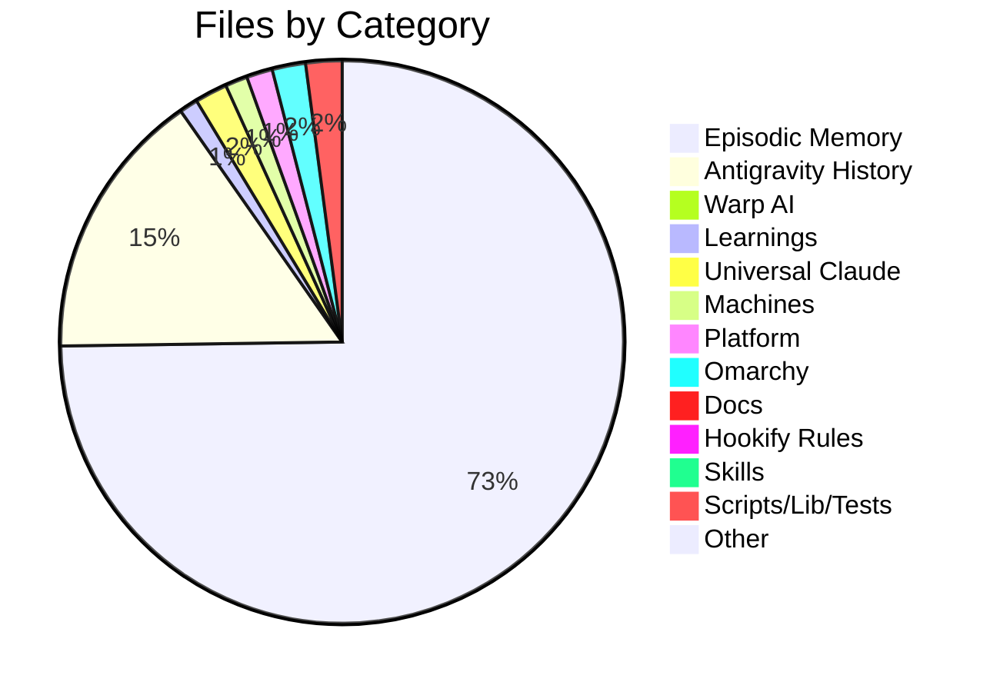
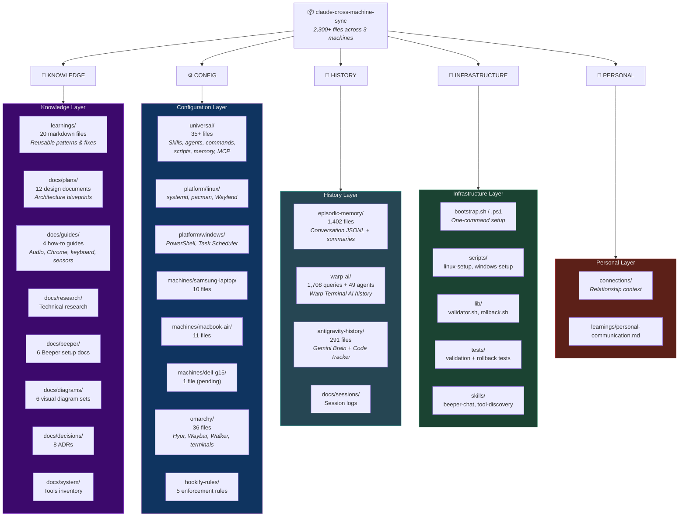

# Full Repository Content Map

## Content Distribution (2,300+ files)

```mermaid
pie title Files by Category
    "Episodic Memory" : 1402
    "Antigravity History" : 291
    "Warp AI" : 8
    "Learnings" : 20
    "Universal Claude" : 35
    "Machines" : 24
    "Platform" : 28
    "Omarchy" : 36
    "Docs" : 39
    "Hookify Rules" : 6
    "Skills" : 4
    "Scripts/Lib/Tests" : 8
    "Other" : 10
```

## Full Directory Map

```mermaid
graph TD
    root["📦 claude-cross-machine-sync<br/><i>2,300+ files across 3 machines</i>"]

    root --> knowledge["📖 KNOWLEDGE"]
    root --> config["⚙️ CONFIG"]
    root --> history["🧠 HISTORY"]
    root --> infra["🔧 INFRASTRUCTURE"]
    root --> personal["👤 PERSONAL"]

    subgraph knowledge_sub["Knowledge Layer"]
        learnings["learnings/<br/>20 markdown files<br/><i>Reusable patterns & fixes</i>"]
        docs_plans["docs/plans/<br/>12 design documents<br/><i>Architecture blueprints</i>"]
        docs_guides["docs/guides/<br/>4 how-to guides<br/><i>Audio, Chrome, keyboard, sensors</i>"]
        docs_research["docs/research/<br/>Technical research"]
        docs_beeper["docs/beeper/<br/>6 Beeper setup docs"]
        docs_diagrams["docs/diagrams/<br/>6 visual diagram sets"]
        docs_decisions["docs/decisions/<br/>8 ADRs"]
        docs_system["docs/system/<br/>Tools inventory"]
    end

    subgraph config_sub["Configuration Layer"]
        universal["universal/<br/>35+ files<br/><i>Skills, agents, commands,<br/>scripts, memory, MCP</i>"]
        platform_linux["platform/linux/<br/><i>systemd, pacman, Wayland</i>"]
        platform_win["platform/windows/<br/><i>PowerShell, Task Scheduler</i>"]
        machines_samsung["machines/samsung-laptop/<br/>10 files"]
        machines_macbook["machines/macbook-air/<br/>11 files"]
        machines_dell["machines/dell-g15/<br/>1 file (pending)"]
        omarchy_conf["omarchy/<br/>36 files<br/><i>Hypr, Waybar, Walker, terminals</i>"]
        hookify["hookify-rules/<br/>5 enforcement rules"]
    end

    subgraph history_sub["History Layer"]
        episodic["episodic-memory/<br/>1,402 files<br/><i>Conversation JSONL + summaries</i>"]
        warp["warp-ai/<br/>1,708 queries + 49 agents<br/><i>Warp Terminal AI history</i>"]
        antigravity["antigravity-history/<br/>291 files<br/><i>Gemini Brain + Code Tracker</i>"]
        sessions["docs/sessions/<br/>Session logs"]
    end

    subgraph infra_sub["Infrastructure Layer"]
        bootstrap["bootstrap.sh / .ps1<br/><i>One-command setup</i>"]
        scripts_dir["scripts/<br/>linux-setup, windows-setup"]
        lib_dir["lib/<br/>validator.sh, rollback.sh"]
        tests_dir["tests/<br/>validation + rollback tests"]
        skills_dir["skills/<br/>beeper-chat, tool-discovery"]
    end

    subgraph personal_sub["Personal Layer"]
        connections["connections/<br/><i>Relationship context</i>"]
        comms["learnings/personal-communication.md"]
    end

    knowledge --> knowledge_sub
    config --> config_sub
    history --> history_sub
    infra --> infra_sub
    personal --> personal_sub

    style knowledge_sub fill:#3c096c,stroke:#7b2cbf,color:#eee
    style config_sub fill:#0f3460,stroke:#533483,color:#eee
    style history_sub fill:#264653,stroke:#2a9d8f,color:#eee
    style infra_sub fill:#1b4332,stroke:#40916c,color:#eee
    style personal_sub fill:#5c2018,stroke:#9b2226,color:#eee
```
