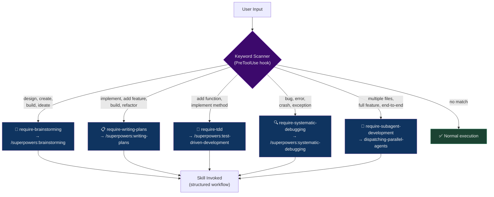
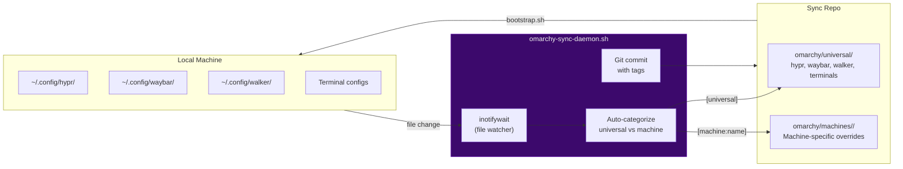

# Hookify Rules Flow

## Skill Enforcement System

```mermaid
graph TD
    user_input["User Input"] --> scan{"Keyword Scanner<br/>(PreToolUse hook)"}

    scan -->|"design, create,<br/>build, ideate"| brainstorm["🧠 require-brainstorming<br/>→ /superpowers:brainstorming"]

    scan -->|"implement, add feature,<br/>build, refactor"| plan["📋 require-writing-plans<br/>→ /superpowers:writing-plans"]

    scan -->|"add function,<br/>implement method"| tdd["🧪 require-tdd<br/>→ /superpowers:test-driven-development"]

    scan -->|"bug, error,<br/>crash, exception"| debug["🔍 require-systematic-debugging<br/>→ /superpowers:systematic-debugging"]

    scan -->|"multiple files,<br/>full feature, end-to-end"| subagent["🤖 require-subagent-development<br/>→ dispatching-parallel-agents"]

    scan -->|"no match"| passthrough["✅ Normal execution"]

    brainstorm --> skill_exec["Skill Invoked<br/>(structured workflow)"]
    plan --> skill_exec
    tdd --> skill_exec
    debug --> skill_exec
    subagent --> skill_exec

    style scan fill:#3c096c,stroke:#7b2cbf,color:#eee
    style brainstorm fill:#0f3460,stroke:#533483,color:#eee
    style plan fill:#0f3460,stroke:#533483,color:#eee
    style tdd fill:#0f3460,stroke:#533483,color:#eee
    style debug fill:#0f3460,stroke:#533483,color:#eee
    style subagent fill:#0f3460,stroke:#533483,color:#eee
    style passthrough fill:#1b4332,stroke:#40916c,color:#eee
```

## Omarchy Sync Flow

```mermaid
flowchart LR
    subgraph local["Local Machine"]
        hypr_local["~/.config/hypr/"]
        waybar_local["~/.config/waybar/"]
        walker_local["~/.config/walker/"]
        terminal_local["Terminal configs"]
    end

    subgraph daemon["omarchy-sync-daemon.sh"]
        watch["inotifywait<br/>(file watcher)"]
        categorize["Auto-categorize<br/>universal vs machine"]
        commit["Git commit<br/>with tags"]
    end

    subgraph repo["Sync Repo"]
        omarchy_u["omarchy/universal/<br/>hypr, waybar, walker, terminals"]
        omarchy_m["omarchy/machines/<name>/<br/>Machine-specific overrides"]
    end

    local -->|"file change"| watch
    watch --> categorize
    categorize -->|"[universal]"| omarchy_u
    categorize -->|"[machine:name]"| omarchy_m
    commit --> repo

    repo -->|"bootstrap.sh"| local

    style daemon fill:#3c096c,stroke:#7b2cbf,color:#eee
```
