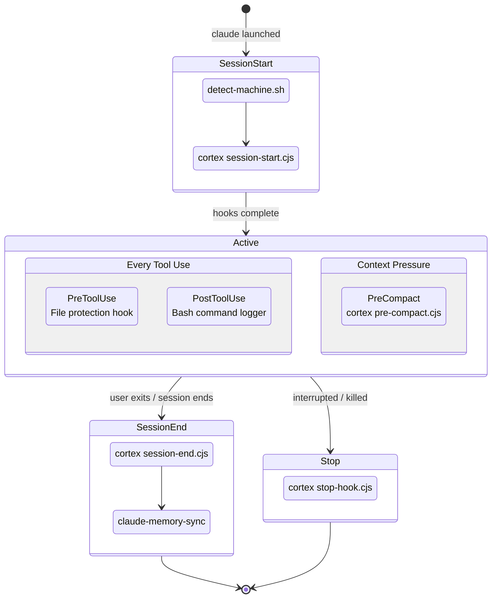
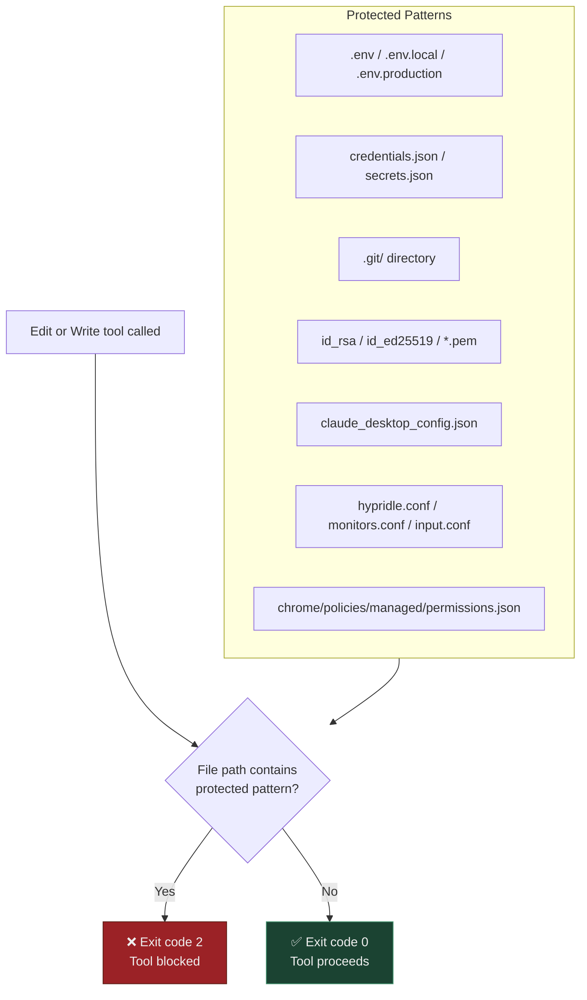
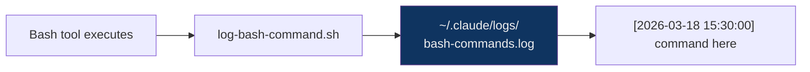

# Hooks Lifecycle

## Session Lifecycle

```mermaid
stateDiagram-v2
    [*] --> SessionStart: claude launched

    state SessionStart {
        detect: detect-machine.sh
        cortex_start: cortex session-start.cjs
        detect --> cortex_start
    }

    SessionStart --> Active: hooks complete

    state Active {
        state "Every Tool Use" as tool {
            pre: PreToolUse<br/>File protection hook
            post: PostToolUse<br/>Bash command logger
        }

        state "Context Pressure" as compact {
            pre_compact: PreCompact<br/>cortex pre-compact.cjs
        }
    }

    Active --> SessionEnd: user exits / session ends

    state SessionEnd {
        cortex_end: cortex session-end.cjs
        mem_sync: claude-memory-sync
        cortex_end --> mem_sync
    }

    Active --> Stop: interrupted / killed

    state Stop {
        cortex_stop: cortex stop-hook.cjs
    }

    SessionEnd --> [*]
    Stop --> [*]
```

## PreToolUse File Protection

```mermaid
graph TD
    tool["Edit or Write tool called"] --> check{"File path contains<br/>protected pattern?"}

    check -->|"Yes"| blocked["❌ Exit code 2<br/>Tool blocked"]
    check -->|"No"| allowed["✅ Exit code 0<br/>Tool proceeds"]

    subgraph patterns["Protected Patterns"]
        env[".env / .env.local / .env.production"]
        creds["credentials.json / secrets.json"]
        git[".git/ directory"]
        ssh["id_rsa / id_ed25519 / *.pem"]
        desktop_cfg["claude_desktop_config.json"]
        hypr["hypridle.conf / monitors.conf / input.conf"]
        chrome_policy["chrome/policies/managed/permissions.json"]
    end

    patterns --> check

    style blocked fill:#9b2226,stroke:#5c2018,color:#eee
    style allowed fill:#1b4332,stroke:#40916c,color:#eee
```

## PostToolUse Bash Logger

```mermaid
flowchart LR
    bash["Bash tool executes"] --> hook["log-bash-command.sh"]
    hook --> log["~/.claude/logs/<br/>bash-commands.log"]
    log --> format["[2026-03-18 15:30:00] command here"]

    style log fill:#0f3460,stroke:#533483,color:#eee
```
