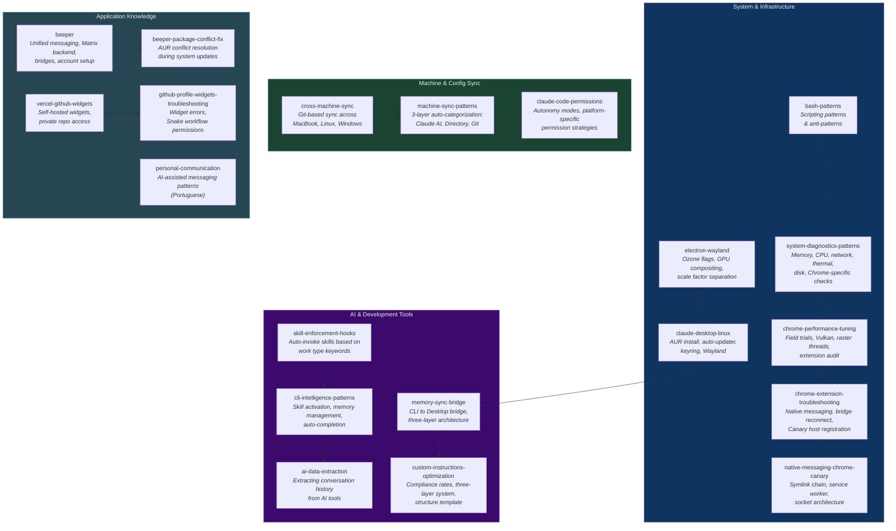
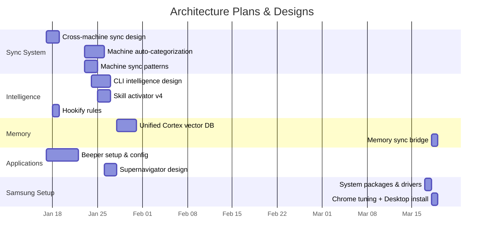

# Knowledge Graph

## Learnings Connections (20 documents)

```mermaid
graph TB
    subgraph system["System & Infrastructure"]
        electron["electron-wayland<br/><i>Ozone flags, GPU compositing,<br/>scale factor separation</i>"]
        chrome_perf["chrome-performance-tuning<br/><i>Field trials, Vulkan, raster threads,<br/>extension audit</i>"]
        chrome_ext["chrome-extension-troubleshooting<br/><i>Native messaging, bridge reconnect,<br/>Canary host registration</i>"]
        native_msg["native-messaging-chrome-canary<br/><i>Symlink chain, service worker,<br/>socket architecture</i>"]
        diagnostics["system-diagnostics-patterns<br/><i>Memory, CPU, network, thermal,<br/>disk, Chrome-specific checks</i>"]
        claude_desktop["claude-desktop-linux<br/><i>AUR install, auto-updater,<br/>keyring, Wayland</i>"]
        bash["bash-patterns<br/><i>Scripting patterns<br/>& anti-patterns</i>"]
    end

    subgraph ai["AI & Development Tools"]
        custom_instr["custom-instructions-optimization<br/><i>Compliance rates, three-layer system,<br/>structure template</i>"]
        cli_intel["cli-intelligence-patterns<br/><i>Skill activation, memory management,<br/>auto-completion</i>"]
        skill_hooks["skill-enforcement-hooks<br/><i>Auto-invoke skills based on<br/>work type keywords</i>"]
        ai_extract["ai-data-extraction<br/><i>Extracting conversation history<br/>from AI tools</i>"]
        memory_sync["memory-sync-bridge<br/><i>CLI to Desktop bridge,<br/>three-layer architecture</i>"]
    end

    subgraph sync["Machine & Config Sync"]
        cross_sync["cross-machine-sync<br/><i>Git-based sync across<br/>MacBook, Linux, Windows</i>"]
        machine_patterns["machine-sync-patterns<br/><i>3-layer auto-categorization:<br/>Claude AI, Directory, Git</i>"]
        permissions["claude-code-permissions<br/><i>Autonomy modes, platform-specific<br/>permission strategies</i>"]
    end

    subgraph apps["Application Knowledge"]
        beeper_kb["beeper<br/><i>Unified messaging, Matrix backend,<br/>bridges, account setup</i>"]
        beeper_fix["beeper-package-conflict-fix<br/><i>AUR conflict resolution<br/>during system updates</i>"]
        vercel_widgets["vercel-github-widgets<br/><i>Self-hosted widgets,<br/>private repo access</i>"]
        gh_widgets["github-profile-widgets-troubleshooting<br/><i>Widget errors,<br/>Snake workflow permissions</i>"]
        personal["personal-communication<br/><i>AI-assisted messaging patterns<br/>(Portuguese)</i>"]
    end

    %% Cross-connections
    electron --> claude_desktop
    electron --> chrome_perf
    chrome_perf --> chrome_ext
    chrome_ext --> native_msg
    diagnostics --> chrome_perf
    claude_desktop --> memory_sync
    memory_sync --> custom_instr
    skill_hooks --> cli_intel
    cli_intel --> ai_extract
    cross_sync --> machine_patterns
    machine_patterns --> permissions
    beeper_kb --> beeper_fix
    vercel_widgets --> gh_widgets
    bash --> diagnostics

    style system fill:#0f3460,stroke:#533483,color:#eee
    style ai fill:#3c096c,stroke:#7b2cbf,color:#eee
    style sync fill:#1b4332,stroke:#40916c,color:#eee
    style apps fill:#264653,stroke:#2a9d8f,color:#eee
```

## Design Documents Timeline

```mermaid
gantt
    title Architecture Plans & Designs
    dateFormat YYYY-MM-DD
    axisFormat %b %d

    section Sync System
    Cross-machine sync design       :2026-01-17, 2d
    Machine auto-categorization     :2026-01-23, 3d
    Machine sync patterns           :2026-01-23, 2d

    section Intelligence
    CLI intelligence design         :2026-01-24, 3d
    Skill activator v4              :2026-01-25, 2d
    Hookify rules                   :2026-01-18, 1d

    section Memory
    Unified Cortex vector DB        :2026-01-28, 3d
    Memory sync bridge              :2026-03-18, 1d

    section Applications
    Beeper setup & config           :2026-01-17, 5d
    Supernavigator design           :2026-01-26, 2d

    section Samsung Setup
    System packages & drivers       :2026-03-17, 1d
    Chrome tuning + Desktop install :2026-03-18, 1d
```
