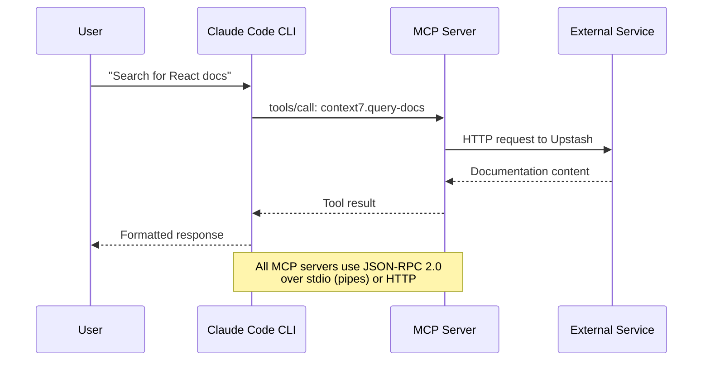

# MCP Server Topology

## Server Distribution

```mermaid
graph TB
    subgraph cli_only["CLI Only"]
        cortex["🧠 cortex<br/>Local vector DB + FTS5<br/>User's own repo"]
        beeper_mcp["💬 beeper<br/>HTTP localhost:23373<br/>Beeper Desktop API"]
    end

    subgraph shared["Shared (CLI + Desktop)"]
        context7["📚 context7<br/>Upstash docs lookup"]
        playwright_mcp["🎭 playwright<br/>Browser automation"]
        filesystem_mcp["📁 filesystem<br/>File read/write"]
        seq["🧮 sequential-thinking<br/>Enhanced reasoning"]
        brave["🔍 brave-search<br/>Web search API"]
        sqlite_mcp["🗃️ sqlite<br/>Database queries"]
        fetch_mcp["🌐 fetch<br/>Web content"]
        time_mcp["⏰ time<br/>Timezone-aware"]
        github_mcp["🐙 github<br/>GitHub API"]
        memory_mcp["💾 memory<br/>Knowledge graph"]
        memsync["🔄 memory-sync<br/>CLI-Desktop bridge"]
    end

    subgraph desktop_only["Desktop Only"]
        chrome_mcp["🌍 chrome<br/>Superpowers Chrome MCP<br/>Browser control"]
    end

    subgraph transports["Transport Protocols"]
        stdio["stdio<br/>(stdin/stdout)"]
        http["HTTP<br/>(REST/SSE)"]
    end

    cortex & context7 & playwright_mcp & filesystem_mcp --> stdio
    seq & brave & sqlite_mcp & fetch_mcp & time_mcp --> stdio
    github_mcp & memory_mcp & memsync & chrome_mcp --> stdio
    beeper_mcp --> http

    style cli_only fill:#5c2018,stroke:#9b2226,color:#eee
    style shared fill:#0f3460,stroke:#533483,color:#eee
    style desktop_only fill:#1b4332,stroke:#40916c,color:#eee
    style transports fill:#1a1a2e,stroke:#e94560,color:#eee
```

## MCP Communication Flow

```mermaid
sequenceDiagram
    participant User
    participant CLI as Claude Code CLI
    participant MCP as MCP Server
    participant Ext as External Service

    User->>CLI: "Search for React docs"
    CLI->>MCP: tools/call: context7.query-docs
    MCP->>Ext: HTTP request to Upstash
    Ext-->>MCP: Documentation content
    MCP-->>CLI: Tool result
    CLI-->>User: Formatted response

    Note over CLI,MCP: All MCP servers use JSON-RPC 2.0<br/>over stdio (pipes) or HTTP
```
