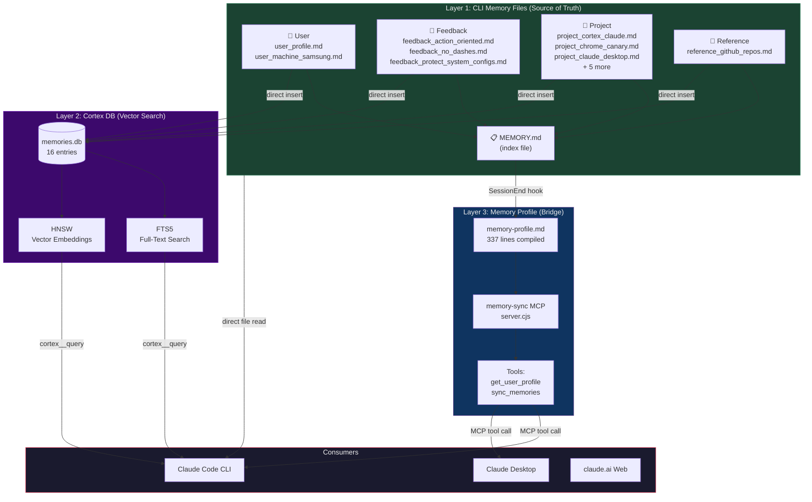
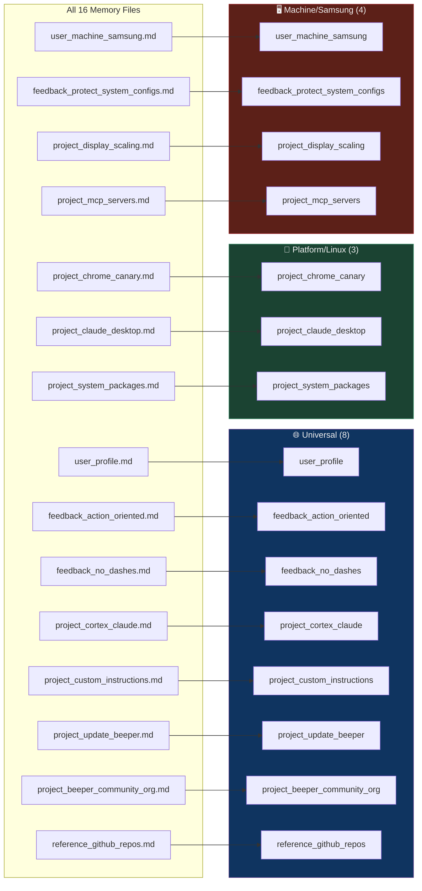

# Memory Architecture

## Three-Layer Memory System

```mermaid
graph TB
    subgraph layer1["Layer 1: CLI Memory Files (Source of Truth)"]
        user["👤 User<br/>user_profile.md<br/>user_machine_samsung.md"]
        feedback["💬 Feedback<br/>feedback_action_oriented.md<br/>feedback_no_dashes.md<br/>feedback_protect_system_configs.md"]
        project["📁 Project<br/>project_cortex_claude.md<br/>project_chrome_canary.md<br/>project_claude_desktop.md<br/>+ 5 more"]
        reference["🔗 Reference<br/>reference_github_repos.md"]
        index["📋 MEMORY.md<br/>(index file)"]
    end

    subgraph layer2["Layer 2: Cortex DB (Vector Search)"]
        fts["FTS5<br/>Full-Text Search"]
        vectors["HNSW<br/>Vector Embeddings"]
        db[("memories.db<br/>16 entries")]
    end

    subgraph layer3["Layer 3: Memory Profile (Bridge)"]
        profile["memory-profile.md<br/>337 lines compiled"]
        mcp["memory-sync MCP<br/>server.cjs"]
        tools["Tools:<br/>get_user_profile<br/>sync_memories"]
    end

    subgraph consumers["Consumers"]
        cli["Claude Code CLI"]
        desktop["Claude Desktop"]
        web["claude.ai Web"]
    end

    user & feedback & project & reference --> index
    index -->|"SessionEnd hook"| profile
    user & feedback & project & reference -->|"direct insert"| db
    db --> fts & vectors
    profile --> mcp --> tools

    layer1 -->|"direct file read"| cli
    tools -->|"MCP tool call"| cli
    tools -->|"MCP tool call"| desktop
    fts & vectors -->|"cortex__query"| cli

    style layer1 fill:#1b4332,stroke:#40916c,color:#eee
    style layer2 fill:#3c096c,stroke:#7b2cbf,color:#eee
    style layer3 fill:#0f3460,stroke:#533483,color:#eee
    style consumers fill:#1a1a2e,stroke:#e94560,color:#eee
```

## Memory Classification for Sync

```mermaid
graph LR
    subgraph all["All 16 Memory Files"]
        direction TB
        u1["user_profile.md"]
        u2["user_machine_samsung.md"]
        f1["feedback_action_oriented.md"]
        f2["feedback_no_dashes.md"]
        f3["feedback_protect_system_configs.md"]
        p1["project_cortex_claude.md"]
        p2["project_chrome_canary.md"]
        p3["project_claude_desktop.md"]
        p4["project_custom_instructions.md"]
        p5["project_display_scaling.md"]
        p6["project_mcp_servers.md"]
        p7["project_system_packages.md"]
        p8["project_update_beeper.md"]
        p9["project_beeper_community_org.md"]
        r1["reference_github_repos.md"]
    end

    subgraph universal["🌐 Universal (8)"]
        uu1["user_profile"]
        uf1["feedback_action_oriented"]
        uf2["feedback_no_dashes"]
        up1["project_cortex_claude"]
        up2["project_custom_instructions"]
        up3["project_update_beeper"]
        up4["project_beeper_community_org"]
        ur1["reference_github_repos"]
    end

    subgraph platform_mem["🐧 Platform/Linux (3)"]
        pp1["project_chrome_canary"]
        pp2["project_claude_desktop"]
        pp3["project_system_packages"]
    end

    subgraph machine_mem["🖥️ Machine/Samsung (4)"]
        mm1["user_machine_samsung"]
        mm2["feedback_protect_system_configs"]
        mm3["project_display_scaling"]
        mm4["project_mcp_servers"]
    end

    u1 --> uu1
    f1 --> uf1
    f2 --> uf2
    p1 --> up1
    p4 --> up2
    p8 --> up3
    p9 --> up4
    r1 --> ur1

    p2 --> pp1
    p3 --> pp2
    p7 --> pp3

    u2 --> mm1
    f3 --> mm2
    p5 --> mm3
    p6 --> mm4

    style universal fill:#0f3460,stroke:#533483,color:#eee
    style platform_mem fill:#1b4332,stroke:#40916c,color:#eee
    style machine_mem fill:#5c2018,stroke:#9b2226,color:#eee
```
