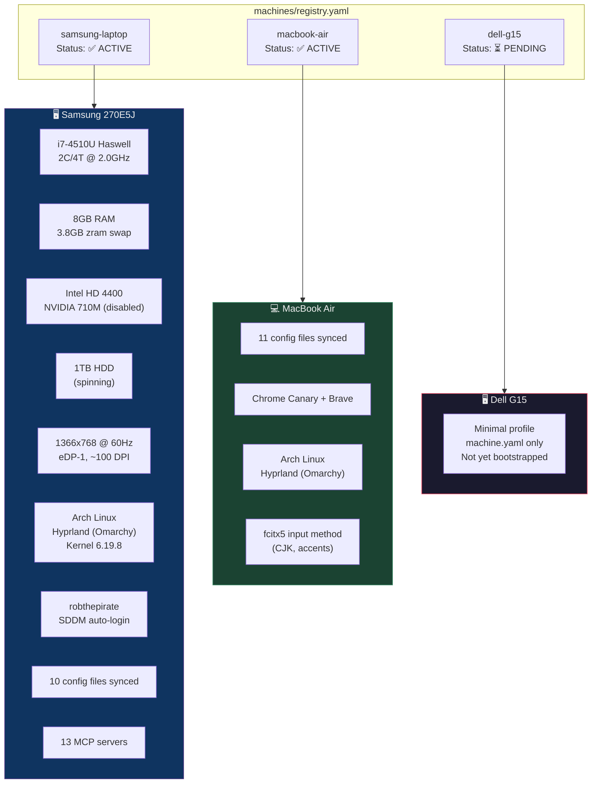

# Multi-Machine State

## Machine Registry

```mermaid
graph TB
    subgraph registry["machines/registry.yaml"]
        direction TB
        r_samsung["samsung-laptop<br/>Status: ✅ ACTIVE"]
        r_macbook["macbook-air<br/>Status: ✅ ACTIVE"]
        r_dell["dell-g15<br/>Status: ⏳ PENDING"]
    end

    subgraph samsung["🖥️ Samsung 270E5J"]
        s_cpu["i7-4510U Haswell<br/>2C/4T @ 2.0GHz"]
        s_ram["8GB RAM<br/>3.8GB zram swap"]
        s_gpu["Intel HD 4400<br/>NVIDIA 710M (disabled)"]
        s_disk["1TB HDD<br/>(spinning)"]
        s_display["1366x768 @ 60Hz<br/>eDP-1, ~100 DPI"]
        s_os["Arch Linux<br/>Hyprland (Omarchy)<br/>Kernel 6.19.8"]
        s_user["robthepirate<br/>SDDM auto-login"]

        s_configs["10 config files synced"]
        s_mcp["13 MCP servers"]
    end

    subgraph macbook["💻 MacBook Air"]
        m_configs["11 config files synced"]
        m_browser["Chrome Canary + Brave"]
        m_os["Arch Linux<br/>Hyprland (Omarchy)"]
        m_input["fcitx5 input method<br/>(CJK, accents)"]
    end

    subgraph dell["🖥️ Dell G15"]
        d_status["Minimal profile<br/>machine.yaml only<br/>Not yet bootstrapped"]
    end

    r_samsung --> samsung
    r_macbook --> macbook
    r_dell --> dell

    style samsung fill:#0f3460,stroke:#533483,color:#eee
    style macbook fill:#1b4332,stroke:#40916c,color:#eee
    style dell fill:#1a1a2e,stroke:#e94560,color:#eee
```

## Config Overlap Between Machines

```mermaid
graph LR
    subgraph shared["🌐 Shared Configs (universal/)"]
        agents["4 agents"]
        commands["6 commands"]
        skills_u["3 skills"]
        scripts_u["6 scripts"]
        memory_u["8 memories"]
        mcp_sync["memory-sync MCP"]
        hooks_u["3 hook templates"]
        shell_u["bash completion"]
    end

    subgraph samsung_only["🖥️ Samsung Only"]
        chrome_flags_s["chrome-canary-flags.conf<br/><i>scale=0.75, no Vulkan,<br/>4 raster threads</i>"]
        hypr_auto["autostart.conf<br/><i>keyring unlock</i>"]
        settings_s["settings.json<br/><i>cortex + memory-sync hooks</i>"]
    end

    subgraph macbook_only["💻 MacBook Only"]
        chrome_flags_m["chrome-canary-flags.conf<br/><i>different scale factor</i>"]
        brave_flags["brave-flags.conf"]
        fcitx["fcitx5 config<br/><i>input methods</i>"]
        hypr_m["hypr/ overrides"]
    end

    subgraph linux_shared["🐧 Linux Shared"]
        electron_flags["electron-flags.conf<br/><i>Wayland + IME</i>"]
        systemd_units["systemd units<br/><i>auto-updater</i>"]
        desktop_update["claude-desktop-update"]
    end

    shared --> samsung_only
    shared --> macbook_only
    linux_shared --> samsung_only
    linux_shared --> macbook_only

    style shared fill:#0f3460,stroke:#533483,color:#eee
    style samsung_only fill:#5c2018,stroke:#9b2226,color:#eee
    style macbook_only fill:#264653,stroke:#2a9d8f,color:#eee
    style linux_shared fill:#1b4332,stroke:#40916c,color:#eee
```
