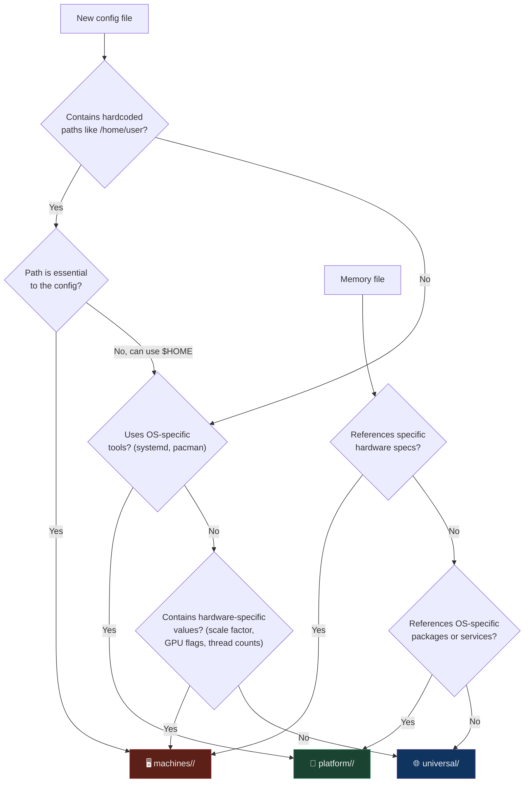

# Repository Structure

## Directory Tree

```mermaid
graph TD
    root["claude-cross-machine-sync/"]

    root --> universal["🌐 universal/<br/><i>Cross-platform configs</i>"]
    root --> platform["🐧 platform/<br/><i>OS-specific configs</i>"]
    root --> machines["🖥️ machines/<br/><i>Hardware-specific configs</i>"]
    root --> learnings["📖 learnings/<br/><i>Reusable knowledge</i>"]
    root --> docs["📄 docs/<br/><i>Documentation</i>"]
    root --> episodic["🧠 episodic-memory/<br/><i>Conversation history</i>"]
    root --> scripts["⚙️ scripts/<br/><i>Sync tooling</i>"]

    universal --> u_claude["claude/<br/>skills, agents, commands,<br/>scripts, memory, MCP servers"]
    universal --> u_electron["electron/<br/>electron-flags.conf"]
    universal --> u_compose["compose/<br/>Docker configs"]

    platform --> p_linux["linux/<br/>scripts, systemd, memory"]
    platform --> p_windows["windows/<br/>PowerShell, Task Scheduler"]

    machines --> m_samsung["samsung-laptop/<br/>settings, chrome flags,<br/>hypr, memory, machine.yaml"]
    machines --> m_macbook["macbook-air/<br/>machine.yaml, configs"]
    machines --> m_registry["registry.yaml"]

    learnings --> l_chrome["chrome-performance-tuning"]
    learnings --> l_desktop["claude-desktop-linux"]
    learnings --> l_memsync["memory-sync-bridge"]
    learnings --> l_native["native-messaging-chrome-canary"]
    learnings --> l_diag["system-diagnostics-patterns"]
    learnings --> l_custom["custom-instructions-optimization"]
    learnings --> l_electron["electron-wayland"]
    learnings --> l_ext["chrome-extension-troubleshooting"]
    learnings --> l_more["+ 12 more..."]

    docs --> d_sessions["sessions/<br/>Detailed session logs"]
    docs --> d_decisions["decisions/<br/>Architecture Decision Records"]
    docs --> d_system["system/<br/>Tools inventory"]
    docs --> d_diagrams["diagrams/<br/>Visual documentation"]

    style universal fill:#0f3460,stroke:#533483,color:#eee
    style platform fill:#1b4332,stroke:#40916c,color:#eee
    style machines fill:#5c2018,stroke:#9b2226,color:#eee
    style learnings fill:#3c096c,stroke:#7b2cbf,color:#eee
    style docs fill:#1a1a2e,stroke:#e94560,color:#eee
    style episodic fill:#264653,stroke:#2a9d8f,color:#eee
```

## Config Classification Decision Tree

```mermaid
graph TD
    file["New config file"] --> q1{"Contains hardcoded<br/>paths like /home/user?"}
    q1 -->|"Yes"| q2{"Path is essential<br/>to the config?"}
    q1 -->|"No"| q3{"Uses OS-specific<br/>tools? (systemd, pacman)"}

    q2 -->|"Yes"| machine["🖥️ machines/<name>/"]
    q2 -->|"No, can use $HOME"| q3

    q3 -->|"Yes"| platform_dest["🐧 platform/<os>/"]
    q3 -->|"No"| q4{"Contains hardware-specific<br/>values? (scale factor,<br/>GPU flags, thread counts)"}

    q4 -->|"Yes"| machine
    q4 -->|"No"| universal_dest["🌐 universal/"]

    file2["Memory file"] --> q5{"References specific<br/>hardware specs?"}
    q5 -->|"Yes"| machine
    q5 -->|"No"| q6{"References OS-specific<br/>packages or services?"}
    q6 -->|"Yes"| platform_dest
    q6 -->|"No"| universal_dest

    style machine fill:#5c2018,stroke:#9b2226,color:#eee
    style platform_dest fill:#1b4332,stroke:#40916c,color:#eee
    style universal_dest fill:#0f3460,stroke:#533483,color:#eee
```
